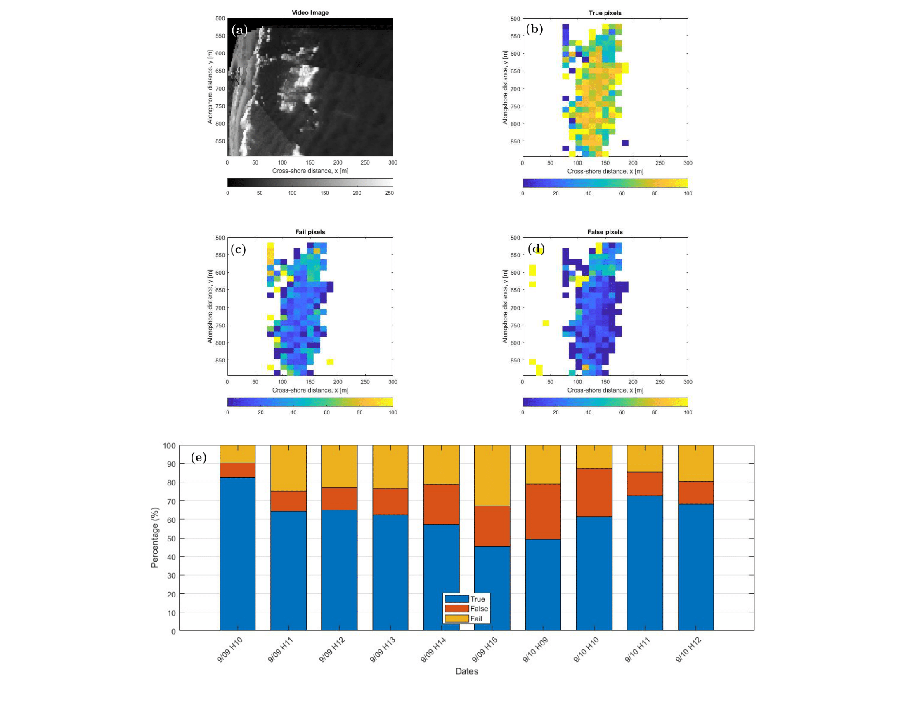

# Wave-by-wave Nearshore Wave Breaking Identificationusing U-Net
A machine learning algorithm based on **the convolutional neural network U-Net** has been trained and validated using as ground truth information a large data set of binary masks obtained from an **automated and independent detection algorithm**.

<!-- TABLE OF CONTENTS -->

[Wave-by-wave Nearshore Wave Breaking Identificationusing U-Net](https://github.com/fj23eslaonda/Wave_by_Wave_Identification)
- [1. Introduction](#1-introduction)
- [2. Data](#2-data)
- [3. Training](#3-training)
- [4. Validation](#4-validation)
- [5. Results](#5-results)
- [6. Mask Analysis](#6-mask-analysis)
- [7. Prediction on Las Cruces](#7-prediction-on-las-cruces)
- [8. Contact](#8-contact)
- [9. Acknowledgements](#9-acknowledgements)

<!-- ABOUT THE PROJECT -->
## 1. Introduction

## 2. Data
Data were collected during a field experiment at the U.S. Army Corp of Engineers Field Research Facility (FRF), Duck, NC. 

  
   

    <em>Duck Beach, NC, USA.</em>

| Dataset                          | Link                                                                                                                     |
| -------------------------------- | ------------------------------------------------------------------------------------------------------------------------ |
| **Train. images (700 frames)**   |  | 
| **Train. masks (700 frames)**    |  | 
| **Test images (400 frames)**     |  | 
| **Test masks (400 frames)**      |  | 

## 3. Training

## 4. Validation 

|Ranking|F1-Score |Comb. Number |Loss      |Comb. Number|
|:-----:|:-------:|:-----------:|:--------:|:----------:|
|    1  |  0,878  |     11      |  0,00849 |     2      |
|    2  |  0,869  |   **3**     |  0,00859 |   **27**   |
|    3  |  0,863  |     35      |  0,00859 |   **3**    |
|    4  |  0,858  |   **27**    |  0,00862 |   **15**   |
|    5  |  0,835  |     26      |  0,00871 |     50     |
|    6  |  0,821  |     59      |  0,00873 |     7      |
|    7  |  0,811  |   **15**    |  0,00878 |   **31**   |
|    8  |  0,801  |   **31**    |  0,00878 |   **11**   |
|    9  |  0,798  |     34      |  0,00905 |     10     |
|    10 |  0,794  |     25      |  0,00908 |     25     |

  
|Comb.  | Batch Size| Epochs | Learn.     | Drop.   | N. Filter | Loss Train.  | Loss Val. | F1 Train. | F1 Val.    |
|:-----:|:---------:|:------:|:----------:|:-------:|:---------:|:------------:|:---------:|:---------:|:----------:|
| **3** |   **2**   | **50** | **0.010**  | **0.8** |   **32**  |  **0,001**   | **0,007** | **0,957** | **0,895**  |
|  11   |     2     |   50   |   0.001    | 0.8     |     32    |    0,002     |   0,008   |   0,929   |   0,862    |
|  15   |     2     |   50   |   0.001    | 0.5     |     32    |    0,004     |   0,007   |   0,886   |   0,840    |
|  27   |     4     |   50   |   0.010    | 0.8     |     32    |    0,004     |   0,010   |   0,918   |   0,863    |
|  31   |     4     |   50   |   0.010    | 0.5     |     32    |    0,007     |   0,009   |   0,807   |   0,780    |

## 5. Results

  

    <em>Duck Beach, NC, USA.</em>

  

    <em>Duck Beach, NC, USA.</em>

Video

## 6. Mask Analysis

  

    <em>Duck Beach, NC, USA.</em>

## 7. Prediction on Las Cruces

  

    <em>Duck Beach, NC, USA.</em>

<!-- CONTACT -->

## 8. Contact

Francisco Sáez - [@LinkedIn](https://www.linkedin.com/in/franciscosaezr/) - francisco.saez@sansano.usm.cl

Project Link: [https://github.com/fj23eslaonda/Wave_by_Wave_Identification](https://github.com/fj23eslaonda/Wave_by_Wave_Identification)

<!-- ACKNOWLEDGEMENTS -->
## 9. Acknowledgements
* [National Laboratory for High Performance Computing (NLHPC)](https://www.nlhpc.cl/)
* [Centro de Investigación para la Gestión Integrada del Riesgo de Desastres (CIGIDEN)](https://www.cigiden.cl/)
* [Centro Científico Tecnológico de Valparaíso (CCTVAL)](http://www.cctval.cl/index.php/es/)
* [Agencia Nacional de investigación y Desarrollo (ANID)](https://www.anid.cl/)
