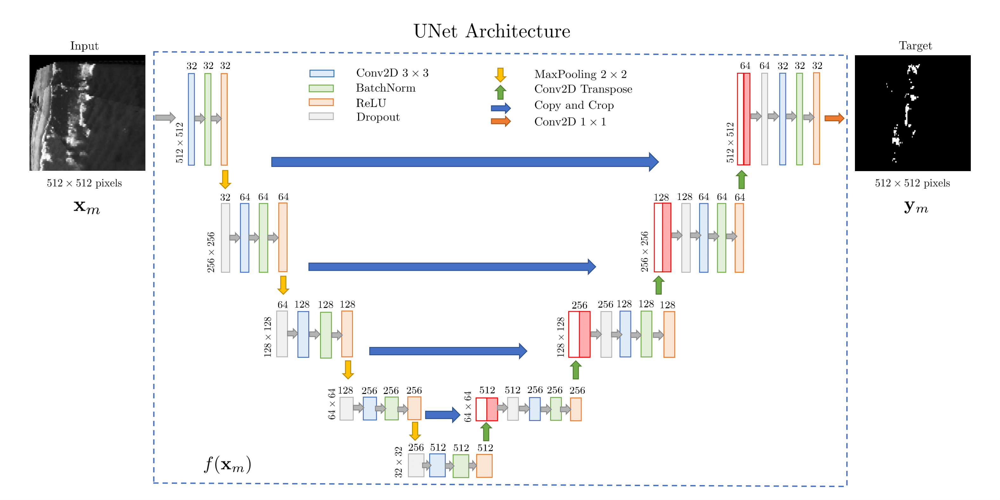

# Wave-by-wave Nearshore Wave Breaking Identificationusing U-Net
A machine learning algorithm based on **the convolutional neural network U-Net** has been trained and validated using as ground truth information a large data set of binary masks obtained from an **automated and independent detection algorithm**.

<!-- TABLE OF CONTENTS -->

[Wave-by-wave Nearshore Wave Breaking Identificationusing U-Net](https://github.com/fj23eslaonda/Wave_by_Wave_Identification)
- [1. Abstract](#1-abstract)
- [2. Data](#2-data)
- [3. Training](#3-training)
- [4. Validation](#4-validation)
- [5. Results](#5-results)
- [6. Prediction on Las Cruces](#6-prediction-on-las-cruces)
- [7. Contact](#7-contact)
- [8. Acknowledgements](#8-acknowledgements)


<!-- ABOUT THE PROJECT -->
## 1. Abstract
Although easily discernible by the naked eye, **a robust and consistent methodology to identify the spatio-temporal occurrence of wave breaking in the nearshore on a wave-by-wave basis has been elusive to date**. In this work, **a Convolutional Neural Network (U-Net) is trained and its performance evaluated using a large number of images in the electro-optical range**, and its performance is compared against an existing sensor-fusion methodology. The results show a good performance of the resulting U-Net model, matching nearly 71% of the breaking instances detected by the sensor-fusion approach. Although this value can be seen as low, **qualitative comparisons show that in many cases, wave breaking identification is improved by the U-Net model**. Moreover, a sample application to a different surfzone showed good qualitative performance, suggesting its applicability to other wave conditions, with short processing times. **This offers the possibility of implementing automated wave breaking detection that could enhance our understanding of nearshore processes**. Hence, **the U-Net model is made available to the community for future testing and continuous development**.

**Main Idea:** 
<p align="center">
  
</p>
<p align="center">
    <em>Figure 1: U-Net architecture, highlighting different steps in the processing as described in the text. Numbers atop colored rectangles denote number of kernels applied on each layer. This figure represent the main idea, from video imagen to U-Net prediction.</em>
</p>

## 2. Data
Data were collected during a field experiment at the U.S. Army Corp of Engineers Field Research Facility (FRF), Duck, NC. The FRF coordinate system is used here, where the cross-shore coordinate is denoted as x and points offshore, the alongshore y axis points roughly 18° west from north, and z = 0 corresponds to the NADV29 vertical datum, with the shoreline locate roughly at x = 90 m. Two remote sensors were used: a single polarization (HH) marine radar (Si-Tex RADARpc-25.9) operating in the microwave range at 9.45 GHz, whose radar antenna was mounted atop a 10-m tower near the north end of the FRF property (x = 17.4 [m], y = 971.4 [m] and z = 13.8 [m]). The marine radar is an active sensor with a 25-kW nominal power and 9-ft open array antenna that rotates at approximately 44 rpm  (see Catalan et al. (2011), for details). The second remote sensing system comprised three optical cameras from the ARGUS III observing station (see Holman and Stanley, 2007, for details).

<p align="center">
  
   
</p>
<p align="center">
    <em>Figure 2: Duck Beach, NC, USA.</em>
</p>

The video images and mask used in this work are presented below.
<p align="center">
  
   
</p>
<p align="center">
    <em>Figure 3: Imagen and label to training respectively.</em>
</p>

**Dataset**

Data used in training the network are available at

[](https://data.mendeley.com/datasets/jprw8tg2hh/draft?a=1cf01733-85b4-4132-9515-07db2e8caf62)


## 3. Training
To the training of U-Net model and replicate the experiments presented in this work is necessary download the training and test images. Then, you must load this images on a fold on Drive. For this, you must create the following folders in you Drive's fold and thus, you can use the same notebook that we presented in this work. **However, this process is not necessary if you know to use Google Colab, but change the Hardware accelerator from None to GPU is very important**.

```
U-Net_Duck
    ├─── trainset_duck
          ├─── images
               ├─── 0.png
               ├─── ...
               ├─── 699.png
          ├─── label
               ├─── 0.png
               ├─── ...
               ├─── 699.png
    ├─── testset_duck
          ├─── images
               ├─── 0.png
               ├─── ...
               ├─── 399.png
          ├─── label
               ├─── 0.png
               ├─── ...
               ├─── 399.png
    ├─── model_final.json
    ├─── best_model_final.h5
    ├─── U-Net Architecture
    ├─── Dataset_matrix
```    

Finally, **you can open the notebook on Google Colab directly**.

[](https://colab.research.google.com/drive/15XsxwXVboi4Zse3yAF6hZqJ6v3AOQiRl?usp=sharing)

## 4. Validation 

The summary of the hyper-parameters tested is shown in Table 1, and **the optimal set is shown in bold**. Assessment of the network thus considered 96 hyper-parameter combinations, that were run with 10 different seeds, **yielding 960 total runs**.

<p>
    <em> Table 1: Space of hyper-parameters tested.  Values in bold represent the best combination.</em>
</p>

| Hyper-parameters   | Values                  |
|:------------------:|:-----------------------:|
| Batch Size         | **2**, 4, 8, 16         |
| Dropout            | 0.5, **0.8**            |
| Learning Rate      | **10^-2**, 10^-3, 10^-4 |
| Number of Filters  | 4, 8, 16, **32**        |

The validation procedure described above yield 96 vectors of hyper-parameter combinations, along with their corresponding BCE loss and accuracy (associated with the F1-Score). These were ranked in decreasing order by their F1 accuracy and increasing order by their BCE loss. In Table 2 the results of the 10 highest ranked hyper-parameter combinations are shown. Considering that it was unlikely that both BCE loss and F2 accuracy could be optimal for the same combination, they were ranked independently. Thus, a total of 15 combinations populate this ranking, **five of which ranked high on both scores (combinations 3, 11, 15, 27 y 31, indicated in bold)**.

<p>
    <em> Table 2: Ranking of best performing combinations.  Denoted in bold are the five sets thatranked high on both scores </em>
</p>

|Ranking|F1-Score |Comb. Number |Loss      |Comb. Number|
|:-----:|:-------:|:-----------:|:--------:|:----------:|
|    1  |  0,878  |     11      |  0,00849 |     2      |
|    2  |  0,869  |   **3**     |  0,00859 |   **27**   |
|    3  |  0,863  |     35      |  0,00859 |   **3**    |
|    4  |  0,858  |   **27**    |  0,00862 |   **15**   |
|    5  |  0,835  |     26      |  0,00871 |     50     |
|    6  |  0,821  |     59      |  0,00873 |     7      |
|    7  |  0,811  |   **15**    |  0,00878 |   **31**   |
|    8  |  0,801  |   **31**    |  0,00878 |   **11**   |
|    9  |  0,798  |     34      |  0,00905 |     10     |
|    10 |  0,794  |     25      |  0,00908 |     25     |

These five candidates of hyper-parameters were trained again, and the resulting networks were applied to the test set, that comprises images never seen by the network. As before, BCE loss and F1 accuracy were used as target performance metrics. **The results are shown in Table 3, ranked in terms of performance. Comb. 3 yields the best performance for the training and validation sets, and it is thus the hyper-parameter combination of choice. Henceforth, it is referred as the U-Net model.**

<p>
    <em> Table 3: Network hyper-parameters and metrics for the five best-ranked networks. </em>
</p>

|Comb.  | Batch Size| Epochs | Learn.     | Drop.   | N. Filter | Loss Train.  | Loss Val. | F1 Train. | F1 Val.    |
|:-----:|:---------:|:------:|:----------:|:-------:|:---------:|:------------:|:---------:|:---------:|:----------:|
| **3** |   **2**   | **50** | **0.010**  | **0.8** |   **32**  |  **0,001**   | **0,007** | **0,957** | **0,895**  |
|  11   |     2     |   50   |   0.001    | 0.8     |     32    |    0,002     |   0,008   |   0,929   |   0,862    |
|  15   |     2     |   50   |   0.001    | 0.5     |     32    |    0,004     |   0,007   |   0,886   |   0,840    |
|  27   |     4     |   50   |   0.010    | 0.8     |     32    |    0,004     |   0,010   |   0,918   |   0,863    |
|  31   |     4     |   50   |   0.010    | 0.5     |     32    |    0,007     |   0,009   |   0,807   |   0,780    |

## 5. Results
One of the main challenges for implementing machine learning techniques, **is to have a good baseline of comparison to train and validate the network**. This is especially challenging for the case of the classification of breaking waves, as it has been fairly difficult to find a reasonable algorithm that would allow consistent identification. For the present implementation, **it has been assumed that the sensor fusion method of Catalán et al. (2011) is robust enough to systematically provide accurate breaking masks without supervision**. This has allowed the use of more than 5000 individual images to assess the overall performance. **However, these  data, assumed to be ground-truth, may also have some occasional errors, that explain in part the apparent low rate of detection of the network, averaging 71% detection of True Pixels**. In Frame A, it can be seen that **the ground truth mask encompasses two breakers that are in close succession near the center of the image**, with high production of remnant foam that is very bright. In consequence, **the sensor fusion algorithm fails to distinguish among them**, and connects them as a single event. In contrast, **the U-Net model result is better defined and resembles in a better way the plan view section of the two breakers**, that are treated as isolated events. Such occurrences on which the ground-truth data overestimates the region of breaking, led to a reduced percentage of detected true pixels, and help explain the low percentage obtained. The similar efect is present in Frame B, where Catalán's methodology indetify breaking waves but with a lot of noise and the U-Net prediction can delete this noise and it identify the breaking wave clearly

<p align="center">
  
</p>
<p align="center">
  
</p>
<p align="center">
    Figure 4: Sample snapshots of the optical image,  and their corresponding results. Frame A is Frame 348 of the Sep 9, 11:00 dataset. Frame B is Frame 437 of the Sep 9, 13:00 dataset. Middle panels show the masks obtained by the sensor fusion method and the U-Net model,respectively.   Right  panels  overlay  these  masks  over  the  snapshot,  for  reference.   Redcontours are the boundaries of the masks.
</p>

<p align="center">
  
</p>
<p align="center">
    <em>Figure 5: Evolution of the a) BCE loss  and b)F1-score .  Performance of Comb.  3 during training (thick blue line) and validation (thick orange line).  Thin graylines correspond to the other four combinations during training (full lines) and validation(dashed lines).</em>
</p>

**Video A**
<div align="center"></div>


**Video B**

<div align="center"></div>

## 6. Prediction on Las Cruces
To use the U-net model to masks prediction of other images, it is necessary to do a pre-processing over this images. **The new images must be of 512x512 pixels and 8-bit grayscale**. Then, images should be uploaded to the same folder defined in section 3 above. The U-Net model should be loaded and you can to do the prediction on your images.


```
U-Net_Duck
    ├─── trainset_duck
    ├─── testset_duck
    ├─── model_final.json
    ├─── best_model_final.h5
    ├─── U-Net Architecture
    ├─── testset_new
         ├─── images
              ├─── 0.png
              ├─── ...
              ├─── N.png
```    

**The U-Net model was tested using  completely new images obtained from a DJI Mavic Pro drone, near Las Cruces, Chile**. This beach is characterized by an energetic wave climate. Sample snapshots are shown in Fig 7, where it can be seen that despite the intense productivity of remnant foam by these strong breakers, **the network does a very reasonable job in detecting rollers across the image**. As before, the main deficiency is near the shoreline. It could be possible that improved camera positioning could improve results near the shoreline. **It is relevant to note that no tuning of the parameters was performed, as the U-Net model was applied directly to these new data. This in contrast with the tuning of thresholds required by the sensor fusion methodology, or threshold-based methodologies in general.**

<p align="center">
  
</p>
<p align="center">
    <em>Figure 7: Sample snapshots of the application of the U-Net model to imagery captured from a drone, near Las Cruces, Chile.</em>
</p>


<!-- CONTACT -->

## 7. Contact

Francisco Sáez - [@LinkedIn](https://www.linkedin.com/in/franciscosaezr/) - francisco.saez@sansano.usm.cl

Project Link: [https://github.com/fj23eslaonda/Wave_by_Wave_Identification](https://github.com/fj23eslaonda/Wave_by_Wave_Identification)


<!-- ACKNOWLEDGEMENTS -->
## 8. Acknowledgements
* [National Laboratory for High Performance Computing (NLHPC)](https://www.nlhpc.cl/)
* [Centro de Investigación para la Gestión Integrada del Riesgo de Desastres (CIGIDEN)](https://www.cigiden.cl/)
* [Centro Científico Tecnológico de Valparaíso (CCTVAL)](http://www.cctval.cl/index.php/es/)
* [Agencia Nacional de investigación y Desarrollo (ANID)](https://www.anid.cl/)
