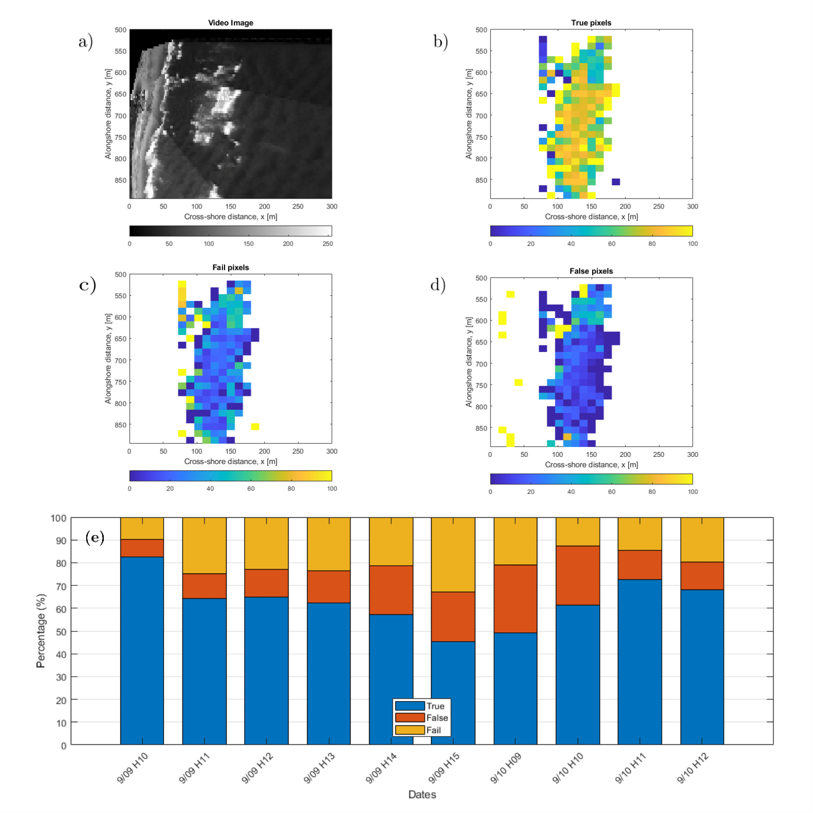

# Wave-by-wave Nearshore Wave Breaking Identificationusing U-Net
A machine learning algorithm based on **the convolutional neural network U-Net** has been trained and validated using as ground truth information a large data set of binary masks obtained from an **automated and independent detection algorithm**.

<!-- TABLE OF CONTENTS -->

[Wave-by-wave Nearshore Wave Breaking Identificationusing U-Net](https://github.com/fj23eslaonda/Wave_by_Wave_Identification)
- [1. Introduction](#1-introduction)
- [2. Data](#2-data)
- [3. Training](#3-training)
- [4. Validation](#4-validation)
- [5. Results](#5-results)
- [6. Mask Analysis](#6-mask-analysis)
- [7. Prediction on Las Cruces](#7-prediction-on-las-cruces)
- [8. Contact](#8-contact)
- [9. Acknowledgements](#9-acknowledgements)


<!-- ABOUT THE PROJECT -->
## 1. Introduction


## 2. Data
Data were collected during a field experiment at the U.S. Army Corp of Engineers Field Research Facility (FRF), Duck, NC. 

<p align="center">
  
   
</p>
<p align="center">
    <em>Figure 1: Duck Beach, NC, USA.</em>
</p>

Las imágenes utilizadas para este trabajo tienen la siguiente forma.
<p align="center">
  
   
</p>
<p align="center">
    <em>Figure 2: Imagen and label to training respectively.</em>
</p>

<p>
    <em> Table 1: Training and Test Set links.</em>
</p>

| Dataset                          | Link                                                                                                                     |
| -------------------------------- | ------------------------------------------------------------------------------------------------------------------------ |
| **Train. images (700 frames)**   | [](https://drive.google.com/drive/folders/1HblJpX-V64x5OUzBPa9A6_09cZBBVTDb?usp=sharing) | 
| **Train. masks (700 frames)**    | [](https://drive.google.com/drive/folders/152kT2FAoK257EOAQPUArJC-dBeqxRhaQ?usp=sharing) | 
| **Test images (400 frames)**     | [](https://drive.google.com/drive/folders/1g1GDRPz5IrdpN4PwCK5IfZ-ZYKCHUzpu?usp=sharing) | 
| **Test masks (400 frames)**      | [](https://drive.google.com/drive/folders/1HblJpX-V64x5OUzBPa9A6_09cZBBVTDb?usp=sharing) | 


## 3. Training
Para poder entrenar U-Net y poder replicar los experimentos presentados en este trabajo es necesario descargar las imagenes de training y test set. Luego, debe cargar estas imágenes en una carpeta en Drive. Para esto es necesario que las carpetas tengan el siguiente orden para así utilizar el mismo notebook que se presenta en este repositorio, en caso contrario, se deberá ajustar los nombres de las carpetas según cada caso. Además, se debe cambiar el entorno de ejecución de Google Colab a GPU.
```
U-Net_Duck
    ├─── trainset_duck
          ├─── images
               ├─── 0.png
               ├─── ...
               ├─── 699.png
          ├─── label
               ├─── 0.png
               ├─── ...
               ├─── 699.png
    ├─── testset_duck
          ├─── images
               ├─── 0.png
               ├─── ...
               ├─── 399.png
          ├─── label
               ├─── 0.png
               ├─── ...
               ├─── 399.png
    ├─── model_final.json
    ├─── best_model_final.h5
    ├─── U-Net Architecture
    ├─── Dataset_matrix
```    

Finalmente, basta con abrir el notebook desde Google Colab [](https://colab.research.google.com/drive/15XsxwXVboi4Zse3yAF6hZqJ6v3AOQiRl?usp=sharing)

## 4. Validation 

Dado el gran número de hiperparámetros que se deben ajustar al implementar una red neuronal convolucional, se tuvo que reducir el espacio dado la capacidad de cómputo seleccionado los siguientes hiperparámetros. La combinación ganadora se puede ver en letra negrita.

<p>
    <em> Table 2: Space of hyper-parameters tested.  Values in bold represent the best combination.</em>
</p>

| Hyper-parameters   | Values                  |
|:------------------:|:-----------------------:|
| Batch Size         | **2**, 4, 8, 16         |
| Dropout            | 0.5, **0.8**            |
| Learning Rate      | **10^-2**, 10^-3, 10^-4 |
| Number of Filters  | 4, 8, 16, **32**        |

The validation procedure described above yield 96 vectors of hyper-parameter combinations, along with their corresponding BCE loss and accuracy (associated with the $F_1$ score). These were ranked in decreasing order by their $F_1$ accuracy and increasing order by their BCE loss. In Table 2 the results of the 10 highest ranked hyper-parameter combinations are shown. Considering that it was unlikely that both BCE loss and $F_1$ accuracy could be optimal for the same combination, they were ranked independently. Thus, a total of 15 combinations populate this ranking, five of which ranked high on both scores (combinations 3, 11, 15, 27 y 31, indicated in bold)

<p>
    <em> Table 3: Ranking of best performing combinations.  Denoted in bold are the five sets thatranked high on both scores </em>
</p>

|Ranking|F1-Score |Comb. Number |Loss      |Comb. Number|
|:-----:|:-------:|:-----------:|:--------:|:----------:|
|    1  |  0,878  |     11      |  0,00849 |     2      |
|    2  |  0,869  |   **3**     |  0,00859 |   **27**   |
|    3  |  0,863  |     35      |  0,00859 |   **3**    |
|    4  |  0,858  |   **27**    |  0,00862 |   **15**   |
|    5  |  0,835  |     26      |  0,00871 |     50     |
|    6  |  0,821  |     59      |  0,00873 |     7      |
|    7  |  0,811  |   **15**    |  0,00878 |   **31**   |
|    8  |  0,801  |   **31**    |  0,00878 |   **11**   |
|    9  |  0,798  |     34      |  0,00905 |     10     |
|    10 |  0,794  |     25      |  0,00908 |     25     |

<p>
    <em> Table 4: Network hyper-parameters and metrics for the five best-ranked networks. </em>
</p>

|Comb.  | Batch Size| Epochs | Learn.     | Drop.   | N. Filter | Loss Train.  | Loss Val. | F1 Train. | F1 Val.    |
|:-----:|:---------:|:------:|:----------:|:-------:|:---------:|:------------:|:---------:|:---------:|:----------:|
| **3** |   **2**   | **50** | **0.010**  | **0.8** |   **32**  |  **0,001**   | **0,007** | **0,957** | **0,895**  |
|  11   |     2     |   50   |   0.001    | 0.8     |     32    |    0,002     |   0,008   |   0,929   |   0,862    |
|  15   |     2     |   50   |   0.001    | 0.5     |     32    |    0,004     |   0,007   |   0,886   |   0,840    |
|  27   |     4     |   50   |   0.010    | 0.8     |     32    |    0,004     |   0,010   |   0,918   |   0,863    |
|  31   |     4     |   50   |   0.010    | 0.5     |     32    |    0,007     |   0,009   |   0,807   |   0,780    |

## 5. Results
<p align="center">
  
</p>

<p align="center">
    Figure 3: Sample snapshots of the optical image,  and their corresponding results. Frame A is Frame 348 of the Sep 9, 11:00 dataset. Middle panels show the masks obtained by the sensor fusion method and the U-Net model,respectively.   Right  panels  overlay  these  masks  over  the  snapshot,  for  reference.   Redcontours are the boundaries of the masks.
</p>

<p align="center">
  
</p>
<p align="center">
    <em>Figure 4: Evolution of the a) BCE loss  and b)F1-score .  Performance of Comb.  3 during training (thick blue line) and validation (thick orange line).  Thin graylines correspond to the other four combinations during training (full lines) and validation(dashed lines).</em>
</p>

**Video A**
<div align="center"></div>


**Video B**

<div align="center"></div>


## 6. Mask Analysis

<p align="center">
  
</p>
<p align="center">
    <em>Figure 5:Statistics of wave breaking detection for all images in data sets. a) Reference snapshot;  Maps of percentage of b) True Pixels; c) Fail Pixels; d)False Pixels; e) Evolution of the distribution of True (green), Fail (dark orange) and False (light orange) Pixels among different wave and lighting conditions.A.</em>
</p>

## 7. Prediction on Las Cruces
Para utilizar el modelo en la predicción de otras imágenes que sea de interés, es necesario realizar un preprocesamiento de estás, dejándolas en imágenes de 512x512 pixeles con una profundidad de 8 bits en escala de grises. Luego, se deben subir las imágenes a la misma carpeta definida anteriormente en la sección 3. Training y generar una nueva carpeta  con las nuevas imágenes. 

```
U-Net_Duck
    ├─── trainset_duck
    ├─── testset_duck
    ├─── model_final.json
    ├─── best_model_final.h5
    ├─── U-Net Architecture
    ├─── testset_new
         ├─── images
              ├─── 0.png
              ├─── ...
              ├─── N.png
```    
Realizando este procedimiento en la playa de Las Cruces en Valparaíso, Chile, si necesidad de reentrenar el modelo, se pudieron obtener los siguientes resultados.

<p align="center">
  
</p>
<p align="center">
    <em>Figure 6: Sample snapshots of the application of the U-Net model to imagery captured from a drone, near Las Cruces, Chile.</em>
</p>


<!-- CONTACT -->

## 8. Contact

Francisco Sáez - [@LinkedIn](https://www.linkedin.com/in/franciscosaezr/) - francisco.saez@sansano.usm.cl

Project Link: [https://github.com/fj23eslaonda/Wave_by_Wave_Identification](https://github.com/fj23eslaonda/Wave_by_Wave_Identification)


<!-- ACKNOWLEDGEMENTS -->
## 9. Acknowledgements
* [National Laboratory for High Performance Computing (NLHPC)](https://www.nlhpc.cl/)
* [Centro de Investigación para la Gestión Integrada del Riesgo de Desastres (CIGIDEN)](https://www.cigiden.cl/)
* [Centro Científico Tecnológico de Valparaíso (CCTVAL)](http://www.cctval.cl/index.php/es/)
* [Agencia Nacional de investigación y Desarrollo (ANID)](https://www.anid.cl/)
